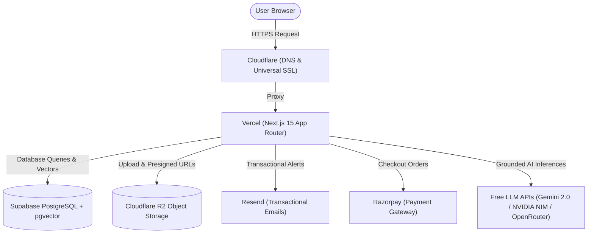

# 🚀 Complete Free-Tier Production Deployment Guide

This guide walks you through deploying **29 AI Workspace** using **100% free-tier services and models**:

- **Frontend (Website)**: [Vercel](https://vercel.com) (Hobby / Free Tier)
- **Database & Backend**: [Supabase](https://supabase.com) (Free Tier Postgres with `pgvector`)
- **Transactional Emails**: [Resend](https://resend.com) (3,000 emails/month free)
- **Payments & Subscriptions**: [Razorpay](https://razorpay.com) (Test / Standard Gateway)
- **Domain & DNS**: [Cloudflare](https://cloudflare.com) (Free DNS, Universal SSL, Edge CDN)
- **Object Storage**: [Cloudflare R2](https://developers.cloudflare.com/r2/) (10 GB free storage, zero egress fees)
- **AI Models**: Free Tier (Google Gemini 2.0 Flash, NVIDIA NIM Free Tier, OpenRouter `:free` models)

---

## 🏗️ Free Architecture Diagram



---

## 1️⃣ Supabase Setup (Database & Vector Store)

1. Create a free project at [supabase.com](https://supabase.com).
2. Navigate to **Database** → **Extensions** and enable `vector` (`pgvector`).
3. In **Project Settings** → **Database**, copy your connection strings:
   - **Transaction Pooler (Port 6543)**: Use for `DATABASE_URL`
   - **Direct Connection (Port 5432)**: Use for `DIRECT_URL`
4. Run schema migration from your terminal:
   ```bash
   npx prisma db push
   ```

---

## 2️⃣ Cloudflare R2 Setup (Object Storage)

1. Sign in to [Cloudflare Dashboard](https://dash.cloudflare.com) and click **R2**.
2. Click **Create bucket** and name it `29-ai-workspace-sources`.
3. In **R2 Overview** → **Manage R2 API Tokens**, create an API token with **Object Read & Write** permissions.
4. Note down your credentials:
   - `R2_ACCOUNT_ID`
   - `R2_ACCESS_KEY_ID`
   - `R2_SECRET_ACCESS_KEY`
   - `R2_BUCKET_NAME=29-ai-workspace-sources`

---

## 3️⃣ Resend Setup (Transactional Emails)

1. Create an account at [resend.com](https://resend.com).
2. In **API Keys**, click **Create API Key** with Full Access.
3. Add to your environment:
   ```ini
   RESEND_API_KEY="re_..."
   RESEND_FROM_EMAIL="29 AI Workspace <onboarding@resend.dev>"
   ```
*(Once you connect your custom domain on Resend, change the sender to `notifications@yourdomain.com`)*.

---

## 4️⃣ Razorpay Setup (Payments & Subscriptions)

1. Sign in to [dashboard.razorpay.com](https://dashboard.razorpay.com).
2. Switch to **Test Mode** (or Live Mode when ready).
3. In **Settings** → **API Keys**, click **Generate Key**.
4. Configure in your environment:
   ```ini
   RAZORPAY_KEY_ID="rzp_test_..."
   RAZORPAY_KEY_SECRET="..."
   ```

---

## 5️⃣ Free AI Model APIs

Configure at least one free LLM API key:

### A. Google Gemini 2.0 Flash (Recommended — High Quality & Fast)
- Get your free key at [aistudio.google.com](https://aistudio.google.com).
```ini
LLM_PROVIDER=gemini
GEMINI_API_KEY="AIzaSy..."
GEMINI_MODEL=gemini-2.0-flash
```

### B. NVIDIA NIM (Free API Credits)
- Get your free key at [build.nvidia.com](https://build.nvidia.com).
```ini
NVIDIA_API_KEY="nvapi-..."
NVIDIA_MODEL=meta/llama-3.3-70b-instruct
```

### C. OpenRouter (Free Tier Catalog)
- Get your free key at [openrouter.ai](https://openrouter.ai).
```ini
OPENROUTER_API_KEY="sk-or-v1-..."
OPENROUTER_CHAT_MODEL=google/gemini-2.0-flash-exp:free
```

---

## 6️⃣ Vercel Frontend Deployment

1. Sign in to [vercel.com](https://vercel.com) and click **Add New Project**.
2. Import your GitHub repository: `VSrikanth05/29-ai-workspace`.
3. Set **Root Directory** to `frontend`.
4. In **Environment Variables**, add the environment keys listed above.
5. Click **Deploy**. Vercel will build and assign an `https://*.vercel.app` domain automatically!

---

## 7️⃣ Cloudflare Custom Domain & SSL

1. In Cloudflare, add your custom domain (e.g. `yourdomain.com`).
2. Add a **CNAME** DNS record:
   - **Type**: `CNAME`
   - **Name**: `@` (or `app`)
   - **Target**: `cname.vercel-dns.com`
   - **Proxy status**: Proxied (Orange Cloud)
3. In **SSL/TLS**, set encryption mode to **Full (strict)**.

---

## ✅ Deployment Checklist

- [x] Supabase Postgres connected with `pgvector`
- [x] Cloudflare R2 bucket created with zero-egress presigned URLs
- [x] Resend API key configured for verification & reset emails
- [x] Razorpay Test key configured with popup checkout
- [x] Google Gemini 2.0 Flash / NVIDIA NIM free models activated
- [x] Vercel project deployed from GitHub `main` branch
